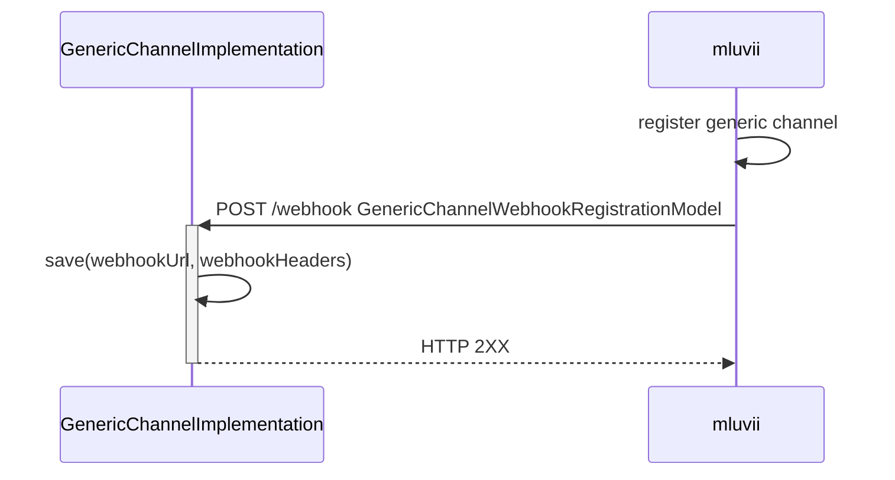
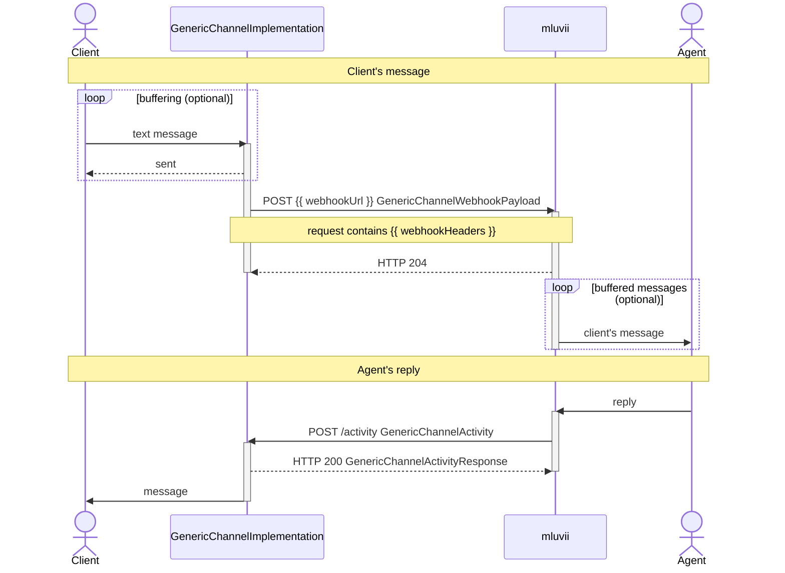

# mluvii Generic Channel Models
## Usage
Include this repository as a submodule in your source tree and reference the csproj from your main project.

To add this repository as a submodule, execute following command in directory of your choice inside your source tree:

``
git submodule add git@github.com:mluvii/mluvii.GenericChannelModels.git
``

## Integration

Communication between mluvii and generic channel implementation is as follows:

### Initial registration

### Chat

## Serialization
### Enumerations
All enumerations must be sent as strings. Special value UNKNOWN must be avoided as it is only used for deserialization.

Enumerations may change by adding new values to them.
Api consumers should ignore unknown values when deserializing and translate these unknown values using UNKNOWN special value that is present in all enumerations.

## Development
The master branch contains production code deployed on app.mluvii.com. Changes about to be released in near future are merged into a branch named after the future version number (2.XX). After such future version gets deployed on production, the corresponding branch is merged into master.
